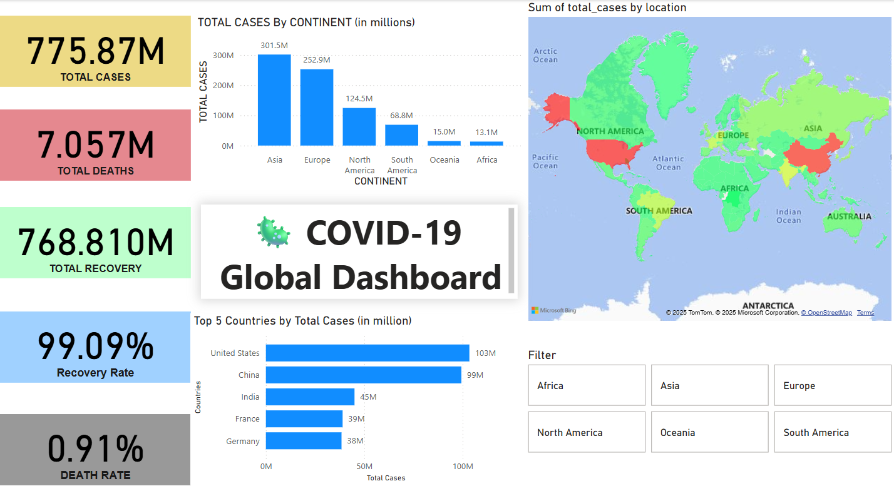
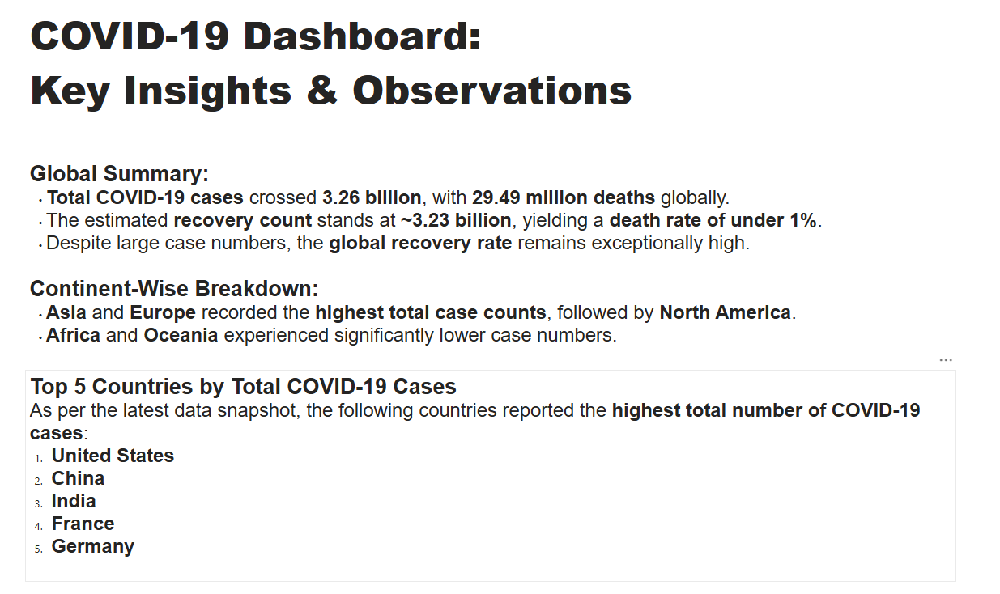

# 🦠 COVID-19 Global Dashboard - Power BI Project

This project is an interactive **COVID-19 Dashboard** built using **Power BI**. It provides insights into total cases, deaths, recovery, and metrics across countries and continents.

## 📊 Features

- ✅ KPI Cards (Total Cases, Deaths, Recovery, Recovery Rate, Death Rate)
- 🌍 Filled Map Visualization (heatmap-style)
- 📈 Column Chart: Total Cases by Continent
- 📌 Top 5 Countries by Total Cases
- 📄 Insight Page with written analysis
- 🧠 Slicers for continent drill-down

## 🧠 Insights Highlight

- Total cases crossed **775.870 million**, with **7.057 million deaths**
- Recovery rate: 99.09%, Death rate < 1% (~0.9%)
- Top affected: USA, China, India, France, Germany
- Asia and Europe were hardest hit

## 📁 Files

- `COVID-19 Global Dashboard.pbix` → Main Power BI file
- `Screenshots/` → Visual previews of the dashboard

## 🛠 Tools Used

- [Power BI Desktop](https://powerbi.microsoft.com/)
- Dataset: [Our World In Data - COVID-19](https://ourworldindata.org/coronavirus)
- DAX for calculated columns and measures

## 🚀 How to Use

1. Clone this repo or download as ZIP
2. Open `COVID-19 Global Dashboard.pbix` in Power BI Desktop
3. Explore the visuals, filters, and insights

## 📸 Preview

## 🧑‍💻 Author

**Abhinav D** – B.Tech CSE (Data Science), 2nd Year

https://www.linkedin.com/in/abhinav-d-bab842300/ - LinkedIn Profile

---

Feel free to fork, star, or reach out for collaboration ideas!
